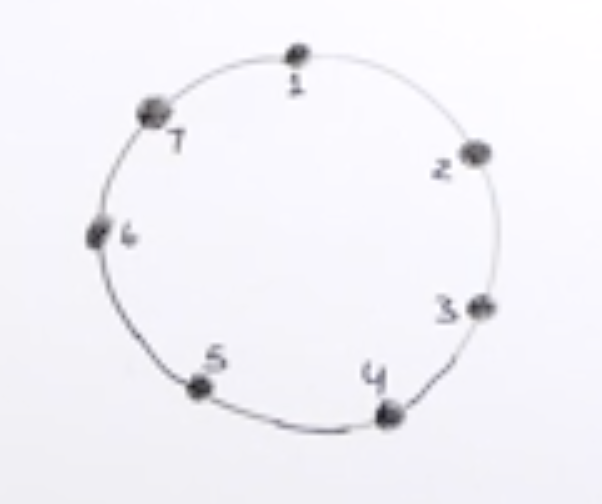

## Introduction  
Recursion is often regarded as the one of the most complex concepts to understand in computer programming. IMHO, recursion is the "building block" of Functional programming, creating highly used data structures like Tree and an elegant way of writing code in general. So in this blog I'll try to go through the basics and later solve a few problems to explain the concept in a better way. So, let's get started!  
## What is Recusion  
Recursion is a methodology of problem solving, where we get the solution of a problem by breaking it down to sub-problems and keep breaking it till we reach a point where we can't break it any further (also known as base condition). Once base condition is reached, we handle it then start returning the solution of the sub-problem state that we are in, to the caller sub-problem state (i.e the parent). 
Hence, this way we can solve the overall problem, by solving the subproblems.  
This is implemented by writing a function that calls itself, with a subset of problem set passed as argument each time, and hence keep breaking the problem.  
## Applications of Recursion  
1. Dynamic Programming
2. Divide and Conquer
3. Backtracking 
4. Tree traversal

## Some problems on recursion

Now let's solve some problems based on recursion, because often examples are best way to understand a concept.

1. Write a recursive function to print all numbers from N to 1 for a given number N.

```
def printN(N):
    if N == 0:
        return
    print(N)
    printN(N-1)
N = int(input("Enter N:"))
printN(N)
```
In the above code, we pass number N by subtracting 1 from it each time, as argument to the function `printN` and it keeps printing it, untill it hits the `base condition` when N becomes equal to 1.

This is also the case of `tail recursion` since we are performing some operation (in this case printing) before we recursively call the funtion `printN`. So `tail recursive` functions are those functions in which recursive calls are last thing that happens in the function. `Tail recursion` is similar to `loop`.  
If we wanted to print 1 to N, then we would place `print` after the recursive call, so that the function stack reaches the based condition when `N == 1`, then starts performing the operations (here printing) as stored in the function stack. This is called `head recursion`. In `head recursion` state is saved before making next call.  
```
def print_one_to_n(N):
    if N == 0:
        return
    print_one_to_n(N-1)
    print(N)
```


`Tail recursion` is faster than `head recursion` because of a concept called [`tail call elimination`](https://www.geeksforgeeks.org/tail-call-elimination/), in which the compiler esentially converts the recursion to a loop. `Quick sort` uses tail recursion, hence is faster than `Merge sort`.   

Hence, making the above `print_one_to_n` function a tail recursive one by this way:-  
```
def print_one_to_n(n,i=1):
    if n == 0:
        return
    print(i)
    print_one_to_n(n-1,i+1)
```

2. Write a recursive function to check if a string is palindrome or not.  
```
def palindrome(s):
    if len(s) <= 1:
        return True
    if s[0] != s[-1]:
        return False
    return palindrome(s[1:len(s)-1])
```  
3. Given `n` people in a circle, `kth` person is killed in every iteration. Find the survivor. (Josephus Problem)  
  


```
def josephus(n,k,start,i,killed=[]):

    if n == len(killed) + 1:
        return set([x for x in range(1,n+1)]) - set(killed)
    if (start+1)%n == 0:
        next = 7
    else:
        next = (start+1)%n
    if start in killed:
        return josephus(n,k,next,i,killed)
    else:
        if i == k:
            killed.append(start)
            return josephus(n,k,start,1,killed)
        return josephus(n,k,next,i+1,killed)
```
